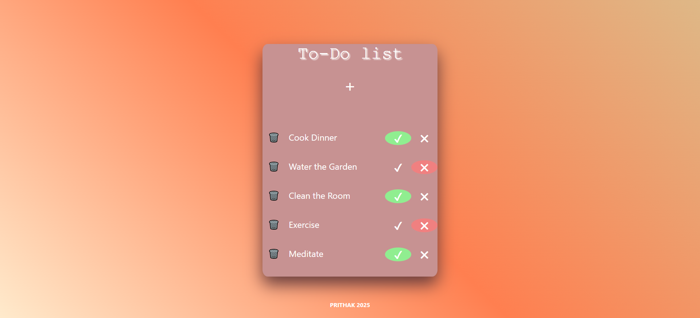

# To-Do-list
Basic to-do-list.

## More
- Helps sort activities out.
- User-friendly and flexible.
- Looks asthetic AF.

## Made using

- **HTML**: Basic skeleton for the to-do-list.
- **CSS**: To style i.e add colors, depth and sizes.
- **JavaScript**: To add functions to the list.

## Usage

1. Just normal cloning 
2. Open the folder
3. Checkout the app.js on src

## Screenshot

